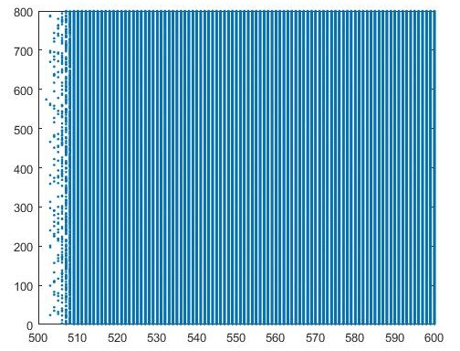

Lab 04:

```
clear all

%ISI with Poisson Distribution
nspikes=1000;
lambda=10;

%poisson=poissrnd(lambda,nspikes,1);

poisson=-lambda.*log(rand(nspikes,1))';
st=cumsum(poisson);

tmax=1000;
dt=0.1;

r=10;
c=1;

tempo=0:dt:tmax;
I=2*(500<tempo & tempo<600);

v(1)=-70;
e=-70;

%sinapse
esyn=0;
w=100;
Gsyn=0.1*w;
n(1)=0;
alfa=1;
beta=1;
delay=10;

psucesso=0.6;
st_pos=0;
repeticoes=100;
T=zeros(repeticoes,length(tempo));

for z=1:repeticoes
    
p2=1;
for p1=1:length(tempo)
if ceil(tempo(p1))==ceil(st(p2)+delay)
	if rand<psucesso;
	T(z,p1)=1;
	end
 
	p2=p2+1;
end
end

limiar=-60;
refratario=1;
pr=1;
for p=1:length(tempo)
 dndt=alfa*T(z,p)*(1-n(p))-beta*n(p);
 Isyn(p)=-Gsyn*n(p)*(v(p)-esyn);
 dvdt=-(v(p)-e)/(r*c)+(I(p)+Isyn(p))/c;
 v(p+1)=v(p)+dvdt*dt;
 n(p+1)=n(p)+dndt*dt;
 
if v(p)>limiar
	if ((tempo(p)-(st(pr)+delay))>refratario)
	v(p)=10;v(p+1)=e;pr=pr+1;
	st_pos(pr-1)=tempo(p);
	end
end
    
end
v(end)=[];
n(end)=[];

k1=1;
for k=1:1/dt:length(tempo)-1/dt
	if max(v(k:k+1/dt))>limiar
	v_binado(z,k1)=1;
	else
	v_binado(z,k1)=0;
	end
	k1=k1+1;
end

end

%Single Run (Exemplo)
figure
subplot(211)
hold on
x=st(st<tmax);
y=ones(length(st(st<tmax)));
plot(x,y,'or');
plot(tempo,T(1,:))
ylabel('Pre-Synaptic')
subplot(212)
hold on
plot(tempo,v(1,:),'-')
plot(st_pos,10*ones(length(st_pos)),'ro')
ylabel('Post-Synaptic')

%Raster Plots
figure
subplot(211)
hold on
for h=1:repeticoes
	raster1(h,:)=h*T(h,:);
	plot(tempo,raster1(h,:),'.');
end
axis([0.5 tmax+1 0.5 repeticoes+0.5])
ylabel('Pre-Synaptic')

subplot(212)
hold on
for h=1:repeticoes
	raster2(h,:)=h*v_binado(h,:);
	plot(0:length(v_binado)-1,raster2(h,:),'.');
end
axis([0.5 tmax+1 0.5 repeticoes+0.5])
ylabel('Post-Synaptic')

%PSTH
figure
deltat=50;
p5=1;
for h=deltat/dt:deltat/dt:tmax/dt
	bin1=sum(T(:,h-deltat/dt+1:h));
	psth1(p5)=sum(bin1)/(repeticoes*deltat*1e-3);
	p5=p5+1;
end
subplot(211)
hold on
bar(0:deltat:tmax-1,psth1)
ylabel('Pre-Synaptic')
axis([0 tmax 0 inf])

p5=1;
for h=deltat:deltat:tmax
	bin2=sum(v_binado(:,h-deltat+1:h));
	psth2(p5)=sum(bin2)/(repeticoes*deltat*1e-3);
	p5=p5+1;
end
subplot(212)
hold on
bar(0:deltat:tmax-1,psth2)
ylabel('Post-Synaptic')
axis([0 tmax 0 inf])
```
a) Substitua o modelo do neurônio do tipo integrate-and-fire desse script pelo modelo do neurônio de Izhikevich.
```
Ne=800;
re=rand(Ne,1);
a=0.02*ones(Ne,1);
b=0.2*ones(Ne,1);
c=-55+15*re.^2;
d=4-6*re.^2;
S=0.5*rand(Ne,Ne);

v=-55*ones(Ne,1);
u=b.*v;
firings=[];

for t=500:600
  I=10*randn(Ne,1);
  fired=find(v>=30);
  firings=[firings; t+0*fired,fired];
  v(fired)=c(fired);
  u(fired)=u(fired)+d(fired);
  I=I+sum(S(:,fired),2);
  v=v+0.5*(0.04*v.^2+5*v+140-u+I);
  v=v+0.5*(0.04*v.^2+5*v+140-u+I); 
u=u+a.*(b.*v-u);
end;
plot(firings(:,1),firings(:,2),'.');
```


b) Injete uma corrente de intensidade 10 entre 500ms<tempo<600ms. Plote o Raster Plot e o PSTH do modelo de Izhikevich para os parâmetros a=0.02,b=0.2, c=-55, d=4 e a=0.1, b=0.2, c=-65 e d=2. Utilize um bin de 50ms para o PSTH. Discuta a diferença entre os dois resultados simulados.
```
Ne=800;
re=rand(Ne,1);
a=0.1*ones(Ne,1);
b=0.2*ones(Ne,1);
c=-65+15*re.^2;
d=2-6*re.^2;
S=0.5*rand(Ne,Ne);

v=-65*ones(Ne,1);
u=b.*v;
firings=[];

for t=500:600
  I=10*randn(Ne,1);
  fired=find(v>=30);
  firings=[firings; t+0*fired,fired];
  v(fired)=c(fired);
  u(fired)=u(fired)+d(fired);
  I=I+sum(S(:,fired),2);
  v=v+0.5*(0.04*v.^2+5*v+140-u+I);
  v=v+0.5*(0.04*v.^2+5*v+140-u+I);
  u=u+a.*(b.*v-u);
end;
plot(firings(:,1),firings(:,2),'.');
```


Podemos observar prioritariamente o aumento na frequência de disparo entre os ms 500 e 600 na condição da célula pós sináptica, em ambos os casos, como já previsto no código. Acompanhando esses disparos intensos, temos disparos mais fracos por todo o período, entretanto esses somente podem ser visualizados por conta do dt = 0.1, em dt menores, há o completo predomínio de disparos no período de 500-600ms.
Já nas células pré-sinápticas podemos observar que existem disparos contínuos e intercalados durante todo o período do plot, estes mais intensos na situação (1). Analisando as variáveis a, b, c e d, podemos perceber que na imagem (1) em relação à (2), o valor de “a” aumentou ­ 0.02 para 0.01 ­ e este é o responsável por amplificar o valor da variável u(t), pois determina a escala de tempo da variável u(t). Já a variável “b” manteve-se constante, a mesma que indica a sensibilidade da variável u(t). A variável “c” foi reduzida de ­55 para ­65, enquanto que a “d” foi de 4 para 2. Essas últimas variáveis alteram os valores de v(t) e u(t), respectivamente, pois “c” indica o valor de restauração da voltagem após a chegada no pico (30mv) e “d” o valor de restauração de u(t) após o pulso, sendo assim, elas intensificam a diferença nas interações.
